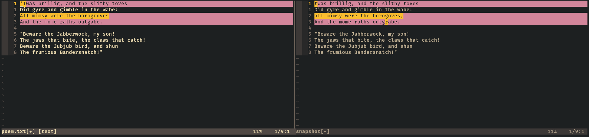
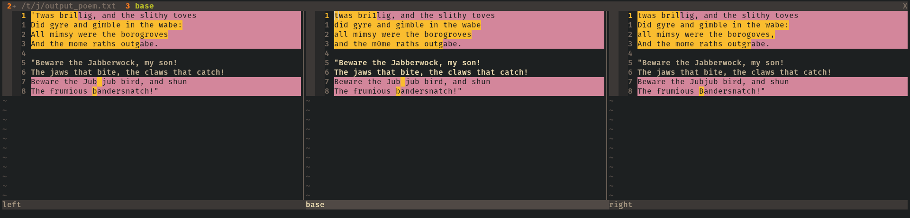
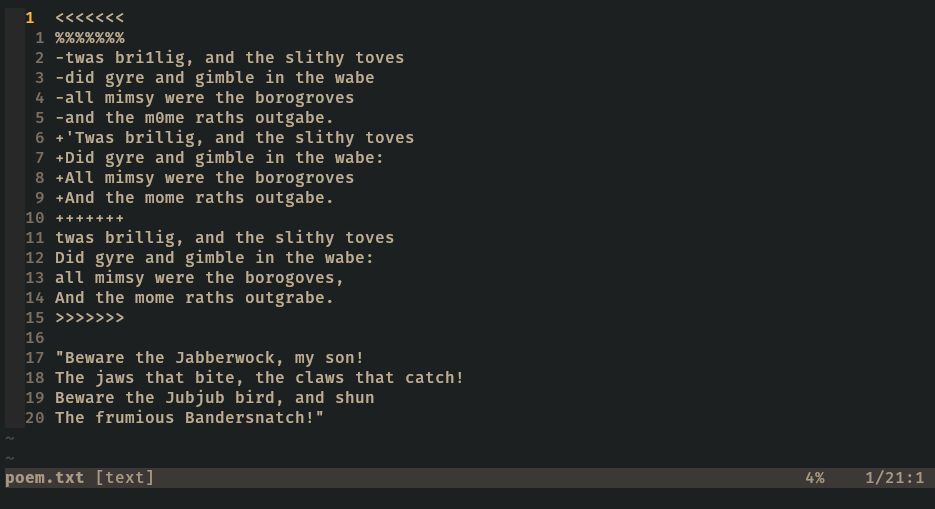

# jj-diffconflicts

`jj-diffconflicts` is a merge tool for the [Jujutsu][] version control system that runs in [Neovim][].
It provides a two-way diff interface to resolve merge conflicts.
It is heavily inspired by Seth House's [diffconflicts] plugin, which provides the same functionality for the Git and Mercurial version control systems.

## Motivation

For explanations about why a two-way diff based on conflict markers might be more effective than a standard 3-way diff that compares file content, you can consult the following resources:

- The ["Why?" section][why] of the README of `whiteinge/diffconflicts`.
- A [short video][] demonstrating how it works, and how it helps honing on the relevant differences between the conflicted sides.
- An [article][] contrasting how different tools handle the same conflict.

But perhaps the best way is to [try it yourself](#test-repository).

## Installation

`jj-diffconflicts` requires Neovim v0.10.0 or above.
It can be installed like any other Neovim plugin.

## Usage

Documentation is available through `:help jj-diffconflicts`.

### Invoking from Neovim

When a buffer with conflict markers is loaded, the merge resolution UI can be invoked through the `:JJDiffConflicts` command.
This will open a two-way diff in vertical splits that highlights the changes between the two sides of the conflict.

To resolve the conflict, edit the left side until it contains the desired changes.
Then save it and exit Neovim with `:qa`.
If you want to abort without resolving the conflict, exit Neovim with `:cq` instead.

### Invoking through `jj resolve`

To configure as a merge tool in Jujutsu, add the following to your [Jujutsu configuration][]:

```toml
[merge-tools.diffconflicts]
program = "nvim"
merge-args = ["-c", "JJDiffConflicts!", "$output", "$base", "$left", "$right"]
merge-tool-edits-conflict-markers = true
```

It can then be invoked with `jj resolve --tool diffconflicts`.

This uses the `:JJDiffConflicts!` variant of the command.
It works the same way as the base command.
But it also opens a history view in a separate tab that contains a 3-way diff between the two sides of the conflict and their common ancestor.
This can be useful to better understand how the two sides of the conflicts diverged, and can help with deciding which changes to keep on the left side of the two-way diff.

If you don't want to use the history view, you can instead set `merge-args` to `["-c", "JJDiffConflicts", "$output"]`.

## Test repository

The `make-conflicts.sh` script creates a Jujutsu repository in the `testrepo` directory whose working copy has two conflicted files.
It can be used to try `jj-diffconflicts` (or any other merge tool).

The first file is `fruits.txt`, which contains the merge conflict described in the [Conflicts][] section of Jujutsu's documentation.

The second file is `poem.txt`, which contains a tricky merge conflict.
When resolving it, one should keep in mind the points from the [merge tools benchmarks][] to judge its effectiveness.

## Troubleshooting

The plugin includes a health check to detect potential issues that would prevent it from functioning properly.
It can be invoked with `:checkhealth jj-diffconflicts`.

## Limitations

- It hasn't yet been used on a wide range of conflicts, so it's possible that it doesn't handle some situations very well (for example, multiple conflicts in the same file).
- It can only resolve one conflict at a time.
  When there are multiple conflicts, it will have to be invoked repeatedly until all of them have been addressed.
- It can only handle 2-sided conflicts (but this is also a limitation of `jj resolve`).
- Jujutsu is still evolving, so future versions could bring changes that the plugin can't handle yet.
  For example, conflict markers were changed between v0.17 and v0.18.

_Caveat emptor_

## Screenshots

### Conflict resolution view



### History view



### Default conflict markers (without plugin)



[article]: https://www.eseth.org/2020/mergetools.html
[conflicts]: https://martinvonz.github.io/jj/latest/conflicts/#conflict-markers
[diffconflicts]: https://github.com/whiteinge/diffconflicts/
[jujutsu configuration]: https://martinvonz.github.io/jj/latest/config/
[jujutsu]: https://martinvonz.github.io/jj/
[merge tools benchmarks]: https://github.com/whiteinge/diffconflicts/blob/master/_utils/README.md#mergetool-benchmarks
[neovim]: https://neovim.io/
[short video]: https://www.youtube.com/watch?v=Pxgl3Wtf78Y
[why]: https://github.com/whiteinge/diffconflicts/#why
